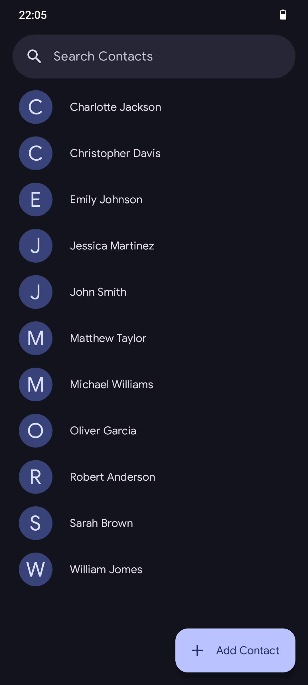

# 📇 Compose Contacts App

## 🌟 Introduction

A simple android application build with Jetpack Compose and Kotlin to manage contacts.

## Screenshot

## ✨ Features

- View contact details
- Add and delete contacts
- Seamlessly store contacts using *Room*, a robust SQLite Database solution
- Abilite to upload an image 

## 🤝 Contributing

#### Contributions are welcome! If you'd like to contribute, please follow these guidelines:

1. Fork the repository and create a new branch for your feature.
2. Make your changes and ensure they are well-tested.
3. Submit a pull request describing your changes and their purpose.

## 📄 License

This project is licensed under the [MIT License](LICENSE).
